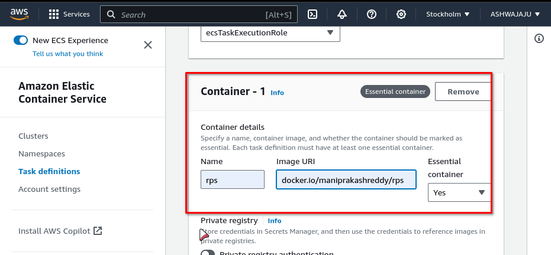

# docker-deployment-aws

# Pushing an Image to Docker Hub

To push an image to Docker Hub using the CLI, follow these steps:

1. **Create a Docker account:** If you don't already have a Docker account, you can create one for free at [https://www.docker.com/](https://www.docker.com/)

2. **Create a Docker repository:** Log in to Docker Hub and click the **Create Repository** button on the [Repositories](https://hub.docker.com/repositories) page. Give your repository a name, a description, and choose whether it should be public or private. Then click the **Create** button.

3. **Build your Docker image:** Build your Docker image using the `docker build` command. For example, to build an image from a Dockerfile named `Dockerfile` in the current directory, you would run the following command:

   ```bash
   docker build -t image-name .
   ```

4. **Tag your Docker image:** Tag your Docker image with your Docker Hub username and the name of the repository you want to push it to. For example, to tag the image you built in step 2 with the username `user-name` and the repository name `repo-name`, you would run the following command:

   ```bash
   docker tag image-name user-name/repo-name:tag-name
   ```

5. **Login to Docker Hub:** Login to Docker Hub using the `docker login` command. For example, to log in with the username `user-name` and password `password`, you would run the following command:

   ```bash
   docker login -u user-name -p password
   ```

   or

   ```bash
   docker login -u user-name
   ```

6. **Push your Docker image to Docker Hub:** Push your Docker image to Docker Hub using the `docker push` command. For example, to push the image you tagged in step 3 to Docker Hub, you would run the following command:

   ```bash
   docker push user-name/repo-name:tag-name
   ```

```bash
cd docker-deployment-aws
docker build -t docker-deployment-aws .
docker tag docker-deployment-aws maniprakashreddy/rps:latest
docker login -u <username>
docker push maniprakashreddy/rps:latest
```
Docker Image: https://hub.docker.com/r/maniprakashreddy/rps

# Deploying a Docker Image to AWS 

Open the AWS Management Console and navigate to the Amazon Elastic Container Service () service.


## Create a task definition:

Navigate to the "Task Definitions" tab in the  console.

- Click on "Create new Task Definition" and select "EC2" as the launch type to run your container on EC2 instances or "Fargate" to run your container on AWS Fargate for Serverless compute for containers.

  
- In the "Container - 1" Enter a name for your container.
- Select the Docker image from Docker Hub.
- Enter image URL Eg: docker.io/maniprakashreddy/rps

  

- Configure the container's ports, environment variables, and other settings as needed.

  

- Click on "Create" to create the task definition.

## Create a cluster:

Navigate to the "Clusters" tab in the  console.

- Click on "Create Cluster"
- Enter a name for your cluster (it can be anything).
- Select the Default namespace. (task which we created in the previous step)
- Select the Infrastructure as your needs (EC2 or Fargate) and click on "Create".

  

## Run a task:

Navigate to the "Clusters" tab in the  console.

- Select the cluster which you created in the previous step.

  

- In the "Tasks" tab, click on "Run new Task".

  
- In "Deployment Configuration" select task Family and enter the number of tasks to run as 1.

  
- Click on "Create" to run the task.

## View the running task:

- Wait for the task to run.

  
  
- Click on the task to view the details.
- In "Network bindings" click on the public IP to view the application.
  

## Your Docker container should now be deployed to AWS  and running successfully. 🫸🫷

example application:


